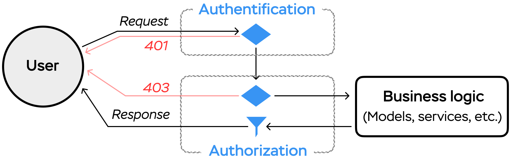

## Action Policy

> Action Policy is an authorization framework for Ruby and Rails applications.

## What is it?

_Authorization_ is an act of giving **someone** official
permission to **do something** (to not be confused with [_authentication_](https://en.wikipedia.org/wiki/Authentication)).

Action Policy provides flexible tools to build an _authorization layer_ for your application.

  

**NOTE:** Action Policy does not force you to use a specific authorization model (i.e., roles, permissions, etc.) and does not provide one. It only answers a single question: **How to verify access?**

## Project State

The project is in active development phase. Check out our [development board](https://github.com/palkan/action_policy/projects/1) to see what's coming next.

## History

Action Policy gem is an _extraction_-kind of a library. Most of the code has been used in production for several years in different [Evil Martians][] projects.

We have decided to collect all our authorization techniques and pack them into a standalone gem–and that is how Action Policy was born!

## What about the existing solutions?

Why did we decide to build our own authorization gem instead of using the existing solutions, such as [Pundit][] and [CanCanCan][]?

**TL;DR they didn't solve all of our problems.**

[Pundit][] has been our framework of choice for a long time. Being too _dead-simple_, it required a lot of hacking to fulfill business logic requirements.

These _hacks_ later become into Action Policy (initially, we even called it "Pundit, re-visited").

We also took a few ideas from [CanCanCan][]—such as [default rules and rule aliases](./aliases.md).

It is also worth noting that Action Policy (despite from a _Railsy_ name) is designed to be **Rails-free**. On the other hand, it contains some Rails-specific extensions and seamlessly integrates into the framework.

So, what are the main reasons to consider Action Policy as your authorization tool?

- **Performance**: multiple [caching strategies](./caching.md) out-of-the-box make authorization overhead as small as possible–especially useful when your rules involve DB queries; you can also monitor the performance and detect the bottlenecks using the built-in [instrumentation](./instrumentation) features.

- **Composition & Customization**: use [only the features you need](./custom_policy.md) or easily extend the functionality–it's just Ruby classes and modules, (almost) zero magic! And you can add authorization [anywhere in your code](./non_rails.md), not only in controllers.

- **Code Organization**: use [namespaces](./namespaces.md) to organize your policies (for example, when you have multiple authorization strategies); add [pre-checks](./pre_checks.md) to make rules more readable and better express your business-logic.

- ...and more: [testability](./testing.md), [i18n](./i18n.md) integrations, [actionable errors](./reasons.md).

Learn more about the motivation behind the Action Policy and its features by watching this [RailsConf talk](https://www.youtube.com/watch?v=NVwx0DARDis).

## Resources

- RailsConf, 2018 "Access Denied" talk [[video](https://www.youtube.com/watch?v=NVwx0DARDis), [slides](https://speakerdeck.com/palkan/railsconf-2018-access-denied-the-missing-guide-to-authorization-in-rails)]

[CanCanCan]: https://github.com/CanCanCommunity/cancancan
[Pundit]: https://github.com/varvet/pundit
[Evil Martians]: https://evilmartians.com
