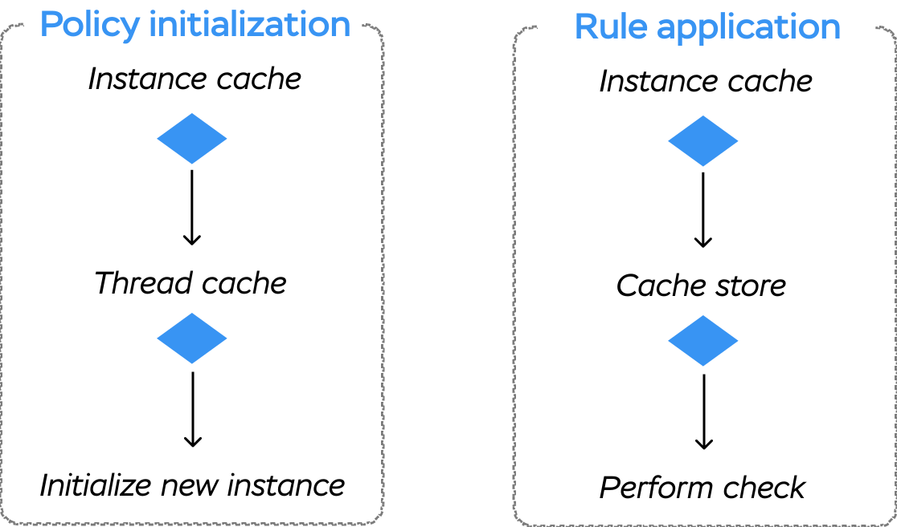

# Caching

Action Policy aims to be as performant as possible. One of the ways to accomplish that is to include a comprehensive caching system.

There are several cache layers available: rule-level memoization, local (instance-level) memoization, and _external_ cache (through cache stores).

<div class="chart-container">
  
</div>

## Policy memoization

### Per-instance

There could be a situation when you need to apply the same policy to the same record multiple times during the action (e.g., request). For example:

```ruby
# app/controllers/posts_controller.rb
class PostsController < ApplicationController
  def show
    @post = Post.find(params[:id])
    authorize! @post
    render :show
  end
end
```

```erb
# app/views/posts/show.html.erb
<h1><%= @post.title %>

<% if allowed_to?(:edit?, @post) %>
  <%= link_to "Edit", @post %>
<% end %>

<% if allowed_to?(:destroy?, @post) %>
  <%= link_to "Delete", @post, method: :delete %>
<% end %>
```

In the above example, we need to use the same policy three times. Action Policy re-uses the policy instance to avoid unnecessary object allocation.

We rely on the following assumptions:
- parent object (e.g., a controller instance) is _ephemeral_, i.e., it is a short-lived object
- all authorizations use the same [authorization context](authorization_context.md).

We use `record.policy_cache_key` with fallback to `record.cache_key` or `record.object_id` as a part of policy identifier in the local store.

**NOTE**: policies memoization is an extension for `ActionPolicy::Behaviour` and could be included with `ActionPolicy::Behaviours::Memoized`.

**NOTE**: memoization is automatically included into Rails controllers integration, but not included into channels integration, since channels are long-lived objects.

### Per-thread

Consider a more complex situation:

```ruby
# app/controllers/comments_controller.rb
class CommentsController < ApplicationController
  def index
    # all comments for all posts
    @comments = Comment.all
  end
end
```

```erb
# app/views/comments/index.html.erb
<% @comments.each do |comment| %>
  <li><%= comment.text %>
    <% if allowed_to?(:edit?, comment) %>
      <%= link_to comment, "Edit" %>
    <% end %>
  </li>
<% end %>
```

```ruby
# app/policies/comment_policy.rb
class CommentPolicy < ApplicationPolicy
  def edit?
    user.admin? || (user.id == record.id) ||
      allowed_to?(:manage?, record.post)
  end
end
```

In some cases, we have to initialize **two** policies for each comment: one for the comment itself and one for the comment's post (in the `allowed_to?` call).

That is an example of a _N+1 authorization_ problem, which in its turn could easily cause a _N+1 query_ problem (if `PostPolicy#manage?` makes database queries). Sounds terrible, doesn't it?

It is likely that many comments belong to the same post. If so, we can move our memoization one level up and use local thread store.

Action Policy provides `ActionPolicy::Behaviours::ThreadMemoized` module with this functionality (included into Rails controllers integration by default).

If you want to add this behavior to your custom authorization-aware class, you should care about cleaning up the thread store manually (by calling `ActionPolicy::PerThreadCache.clear_all`).

**NOTE:** per-thread cache is disabled by default in test environment (when either `RACK_ENV` or `RAILS_ENV` environment variable is equal to "test").
You can turn it on (or off) by setting:

```ruby
ActionPolicy::PerThreadCache.enabled = true # or false to disable
```

## Rule cache

### Per-instance

There could be a situation when the same rule is called multiple times for the same policy instance (for example, when using [aliases](aliases.md)).

In that case, Action Policy invokes the rule method only once, remembers the result, and returns it immediately for the subsequent calls.

**NOTE**: rule results memoization is available only if you inherit from `ActionPolicy::Base` or include `ActionPolicy::Policy::CachedApply` into your `ApplicationPolicy`.

### Using the cache store

Some policy rules might be _performance-heavy_, e.g., make complex database queries.

In that case, it makes sense to cache the rule application result for a long time (not just for the duration of a request).

Action Policy provides a way to use _cache stores_ for that. You have to explicitly define which rules you want to cache in your policy class. For example:

```ruby
class StagePolicy < ApplicationPolicy
  # mark show? rule to be cached
  cache :show?
  # you can also provide store-specific options
  # cache :show?, expires_in: 1.hour

  def show?
    full_access? ||
      user.stage_permissions.where(
        stage_id: record.id
      ).exists?
  end

  private

  def full_access?
    !record.funnel.is_private? ||
      user.permissions
        .where(
          funnel_id: record.funnel_id,
          full_access: true
        ).exists?
  end
end
```

You must configure a cache store to use this feature:

```ruby
ActionPolicy.cache_store = MyCacheStore.new
```

Or, in Rails:

```ruby
# config/application.rb (or config/environments/<environment>.rb)
Rails.application.configure do |config|
  config.action_policy.cache_store = :redis_cache_store
end
```

Cache store must provide at least a `#read(key)` and `#write(key, value, **options)` methods.

**NOTE:** cache store also should take care of serialiation/deserialization since the `value` is `ExecutionResult` instance (which contains also some additional information, e.g. failure reasons). Rails cache store supports serialization/deserialization out-of-the-box.

By default, Action Policy builds a cache key using the following scheme (defined in `#rule_cache_key(rule)` method):

```ruby
"#{cache_namespace}/#{context_cache_key}" \
"/#{record.policy_cache_key}/#{policy.class.name}/#{rule}"
```

Where `cache_namespace` is equal to `"acp:#{MAJOR_GEM_VERSION}.#{MINOR_GEM_VERSION}"`, and `context_cache_key` is a concatenation of all authorization contexts cache keys (in the same order as they are defined in the policy class).

If any object does not respond to `#policy_cache_key`, we fallback to `#cache_key` (or `#cache_key_with_version` for modern Rails versions). If `#cache_key` is not defined, an `ArgumentError` is raised.

**NOTE:** if your `#cache_key` method is performance-heavy (e.g. like the `ActiveRecord::Relation`'s one), we recommend to explicitly define the `#policy_cache_key` method on the corresponding class to avoid unnecessary load. See also [action_policy#55](https://github.com/palkan/action_policy/issues/55).

You can define your own `rule_cache_key` / `cache_namespace` / `context_cache_key` methods for policy class to override this logic.

You can also use the `#cache` instance method to cache arbitrary values in you policies:

```ruby
class ApplicationPolicy < ActionPolicy::Base
  # Suppose that a user has many roles each having an array of permissions
  def permissions
    cache(user) { user.roles.pluck(:permissions).flatten.uniq }
  end

  # You can pass multiple cache key "parts"
  def account_permissions(account)
    cache(user, account) { user.account_roles.where(account: account).pluck(:permissions).flatten.uniq }
  end
end
```

**NOTE:** `#cache` method uses the same cache key generation logic as rules caching (described above).

#### Invalidation

There no one-size-fits-all solution for invalidation. It highly depends on your business logic.

**Case \#1**: no invalidation required.

First of all, you should try to avoid manual invalidation at all. That could be achieved by using elaborate cache keys.

Let's consider an example.

Suppose that your users have _roles_ (i.e. `User.belongs_to :role`) and you give access to resources through the `Access` model (i.e. `Resource.has_many :accesses`).

Then you can do the following:
- Keep tracking the last `Access` added/updated/deleted for resource (e.g. `Access.belongs_to :accessessable, touch: :access_updated_at`)
- Use the following cache keys:

```ruby
class User
  def policy_cache_key
    "user::#{id}::#{role_id}"
  end
end

class Resource
  def policy_cache_key
    "#{resource.class.name}::#{id}::#{access_updated_at}"
  end
end
```

**Case \#2**: discarding all cache at once.

That's pretty easy: just override `cache_namespace` method in your `ApplicationPolicy` with the new value:

```ruby
class ApplicationPolicy < ActionPolicy::Base
  # It's a good idea to store the changing part in the constant
  CACHE_VERSION = "v2".freeze

  # or even from the env variable
  # CACHE_VERSION = ENV.fetch("POLICY_CACHE_VERSION", "v2").freeze

  def cache_namespace
    "action_policy::#{CACHE_VERSION}"
  end
end
```

**Case \#3**: discarding some keys.

That is an alternative approach to _crafting_ cache keys.

If you have a limited number of places in your application where you update access control,
you can invalidate policies cache manually. If your cache store supports `delete_matched` command (deleting keys using a wildcard), you can try the following:

```ruby
class ApplicationPolicy < ActionPolicy::Base
  # Define custom cache key generator
  def cache_key(rule)
    "policy_cache/#{user.id}/#{self.class.name}/#{record.id}/#{rule}"
  end
end

class Access < ApplicationRecord
  belongs_to :resource
  belongs_to :user

  after_commit :cleanup_policy_cache, on: [:create, :destroy]

  def cleanup_policy_cache
    # Clear cache for the corresponding user-record pair
    ActionPolicy.cache_store.delete_matched(
      "policy_cache/#{user_id}/#{ResourcePolicy.name}/#{resource_id}/*"
    )
  end
end

class User < ApplicationRecord
  belongs_to :role

  after_commit :cleanup_policy_cache, on: [:update], if: :role_id_changed?

  def cleanup_policy_cache
    # Clear all policies cache for user
    ActionPolicy.cache_store.delete_matched(
      "policy_cache/#{user_id}/*"
    )
  end
end
```
